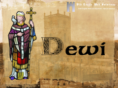

# Dewi
A fully fledged theme, grown out of the Spacious theme, from ThemeGrill, incorporating many original ideas and additions.

## Origin
I originally used ThemeGrill's Spacious theme on my website, and, in accordance with best practise, developed a Child Theme that would incorporate my changes. In this child theme, I added a number of important additions, including social media buttons, and support for the Woocommerce plugin.

All proceeded well, until Spacious 1.3.4. In this version, a number of functions were altered that broke my website. I am sure that these functions worked better. I was faced with either reworkiing my child theme from the ground up - which, a few months ago I would have done - or combining child theme and main theme into one custom grown theme, albeit with other people's legacy code. I decided on the latter, and the Dewi theme was born.

## Dewi?
Dewi is the Welsh for David, as in the ancient Welsh preacher. Dewi Sant is thus St David. The screenshot shows a stained glass of Dewi, and the huge cathedral at the city of St Davids.

## What will the Dewi theme do?
Dewi is a fully responsive theme. It is able to display an excellent slider. The theme looks good on any platform, and is easily customizable, both through the customizer and through a detailed options panel.

## Support
Support is limited, as I do not have much time. However, you can try messaging me through http://www.oldcastleweb.com

